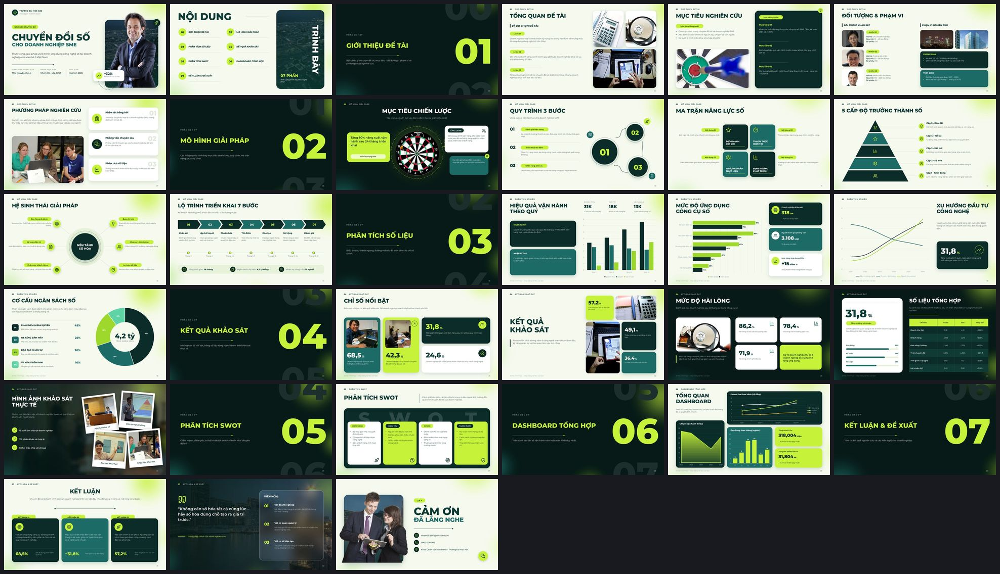
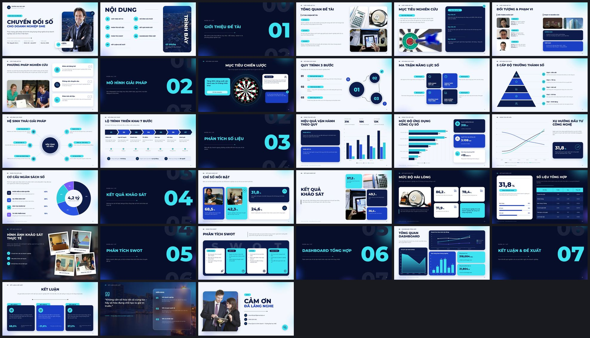
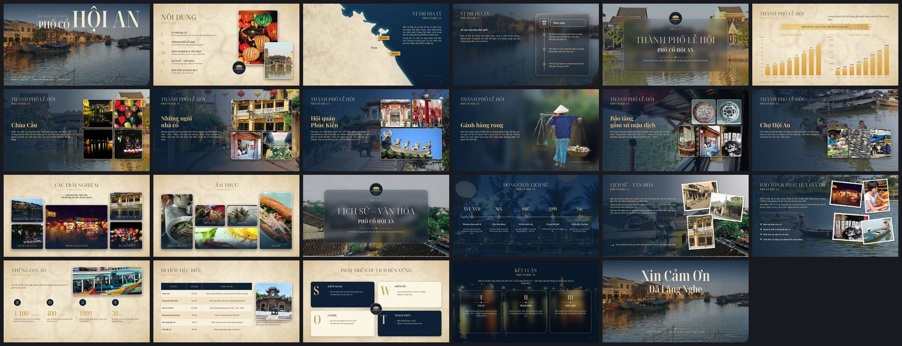

# Kho Mẫu Slide DAKO

Danh sách mẫu slide. Trang thư viện có ảnh xem trước: [https://claude.ai/artifact/JmoetKFXwLHYifaeGuBUih](https://claude.ai/artifact/JmoetKFXwLHYifaeGuBUih)

**Cách gọi mẫu:** trong phiên Claude Code của kho này, gõ câu gọi bên dưới và đính kèm tài liệu (Word, PDF, PowerPoint, ghi chú…). Claude sẽ dàn nội dung vào mẫu và trả về file `.pptx` có hiệu ứng.

| Mã | Tên mẫu | Phong cách | Phù hợp cho | Trạng thái |
|---|---|---|---|---|
| **M01** | Báo cáo Xanh Lime | Báo cáo đề tài hiện đại: rêu đậm + xanh lime, nhân vật tách nền bật khỏi khung ảnh. | Báo cáo môn học, tiểu luận, khóa luận; Báo cáo nghiên cứu có khảo sát, số liệu; Đề án, kế hoạch, báo cáo dự án | 33 slide |
| **M02** | Báo cáo Aurora | Cùng bố cục với M01, tông xanh navy + aqua – hợp báo cáo công nghệ, doanh nghiệp. | Báo cáo công nghệ, chuyển đổi số; Báo cáo kinh doanh, kết quả quý / năm; Thuyết trình dự án cho doanh nghiệp | 33 slide |
| **M03** | Di sản Hội An | Cổ điển, điện ảnh: ảnh tràn nền phủ tối, chữ có chân mảnh, giấy cổ, ảnh polaroid mép rách. | Văn hóa, lịch sử, di sản, địa danh; Du lịch, ẩm thực, giới thiệu địa phương; Báo cáo môn Văn hóa Việt Nam, Lịch sử, Địa lý | 23 slide |
| **M04** | Chính luận Mác – Lênin | Sắp làm: mẫu cho các môn lý luận chính trị. | Chính trị – xã hội; Báo cáo – học thuật | Sắp làm |
| **M05** | Lao động – Việc làm | Sắp làm: mẫu cho chủ đề kinh tế – xã hội, thị trường lao động. | Chính trị – xã hội; Doanh nghiệp | Sắp làm |

## M01 · Báo cáo Xanh Lime

Báo cáo đề tài hiện đại: rêu đậm + xanh lime, nhân vật tách nền bật khỏi khung ảnh.

- **Câu gọi:** `Dùng mẫu M01 · Báo cáo Xanh Lime để làm bộ slide từ tài liệu tôi gửi kèm.`
- **Gọi tắt:** xanh lime, lime, báo cáo xanh, mẫu báo cáo xanh lime, báo cáo sinh viên, video 1
- **Bảng màu:** `#0B2C28` Rêu đậm, `#1D6B67` Xanh rêu, `#C6F23A` Lime, `#F6FAEE` Nền sáng, `#071A17` Nền tối
- **Font:** Montserrat
- **File mẫu:** `slides-template/output/Mau-Bao-Cao-Lime.pptx` (7.4 MB)
- **Dựng:** `python build_deck.py --theme lime --content <file.json> --name <Ten-file>` — nội dung mẫu: `catalog/samples/M01-M02-baocao.json`
- **Lấy cảm hứng từ:** Video 1 – mẫu báo cáo xanh lime (TikTok)
- **Các dạng slide** (`"slide"` trong file nội dung): `cover` Bìa – người tách nền bật khỏi khung ảnh, `agenda` Mục lục 7 phần, `section` Chuyển phần số lớn, `overview` Tổng quan + khảm 3 ảnh, `objectives` Mục tiêu tổng quát / cụ thể, `subjects` Đối tượng & phạm vi, `methods` Phương pháp (3 thẻ icon), `target` Bảng phi tiêu – mục tiêu chiến lược, `cycle` Chu trình 3 bước, `blocks4` Ma trận 2×2, `pyramid` Kim tự tháp 5 cấp, `hub` Trung tâm + 6 vệ tinh, `process` Lộ trình chevron 7 bước, `chart_columns` Biểu đồ cột + KPI, `chart_bars` Biểu đồ thanh ngang, `chart_lines` Biểu đồ đường, `chart_donut` Biểu đồ tròn, `stats4` 4 chỉ số có ảnh, `stats_mosaic` Khảm số liệu, `stats_dark` Chỉ số nền tối, `table_slide` Bảng số liệu + thanh tiến độ, `gallery` Ảnh polaroid trên nền mờ, `swot` SWOT, `dashboard` Dashboard 3 biểu đồ, `conclusion` Kết luận 3 thẻ, `proposal` Kiến nghị – thẻ kính mờ, `thanks` Cảm ơn

## M02 · Báo cáo Aurora

Cùng bố cục với M01, tông xanh navy + aqua – hợp báo cáo công nghệ, doanh nghiệp.

- **Câu gọi:** `Dùng mẫu M02 · Báo cáo Aurora để làm bộ slide từ tài liệu tôi gửi kèm.`
- **Gọi tắt:** aurora, xanh navy, báo cáo xanh dương, navy aqua, biến thể của M01
- **Bảng màu:** `#0C1B49` Navy, `#1B3FC4` Xanh hoàng gia, `#3DE3F0` Aqua, `#F4F7FE` Nền sáng, `#060E2A` Nền tối
- **Font:** Montserrat
- **File mẫu:** `slides-template/output/Mau-Bao-Cao-Aurora.pptx` (7.5 MB)
- **Dựng:** `python build_deck.py --theme aurora --content <file.json> --name <Ten-file>` — nội dung mẫu: `catalog/samples/M01-M02-baocao.json`
- **Lấy cảm hứng từ:** Biến thể màu của M01 (cùng bố cục)
- **Các dạng slide:** giống M01

## M03 · Di sản Hội An

Cổ điển, điện ảnh: ảnh tràn nền phủ tối, chữ có chân mảnh, giấy cổ, ảnh polaroid mép rách.

- **Câu gọi:** `Dùng mẫu M03 · Di sản Hội An để làm bộ slide từ tài liệu tôi gửi kèm.`
- **Gọi tắt:** hội an, hoi an, di sản, phố cổ, văn hóa, du lịch, cổ điển, video 2
- **Bảng màu:** `#0D2136` Navy đêm, `#C9A15B` Vàng kim, `#E2BF7A` Vàng nhạt, `#F3EAD4` Giấy cổ, `#3D2B1B` Nâu mực
- **Font:** Noto Serif Display · Noto Serif · Playfair Display
- **File mẫu:** `slides-template/output/Mau-Bao-Cao-HoiAn.pptx` (20.3 MB)
- **Dựng:** `python build_hoian.py --content <file.json> --name <Ten-file>` — nội dung mẫu: `catalog/samples/M03-hoian.json`
- **Lấy cảm hứng từ:** Video 2 – mẫu Phố cổ Hội An (TikTok)
- **Các dạng slide** (`"slide"` trong file nội dung): `cover` Bìa chữ lớn trên ảnh, `agenda` Mục lục số La Mã trên giấy cổ, `map_slide` Bản đồ + tuyến đường (tools/make_map.py), `glass_timeline` Thẻ kính mờ có mốc thời gian, `section` Chuyển phần – thẻ kính + huy hiệu, `charts` 2 biểu đồ cột vàng + dải cọ, `place` Địa danh + khảm 3–5 ảnh, `place_cutout` Nhân vật / đồ vật tách nền, `mosaic` Khảm ảnh có chú thích (trải nghiệm, ẩm thực), `timeline` Dòng thời gian 5 mốc, `polaroids` Ảnh polaroid mép rách + nội dung, `numbers` Những con số, `table_slide` Bảng trên giấy cổ, `swot` SWOT, `conclusion` Kết luận – 3 thẻ kính, `thanks` Cảm ơn

## M04 · Chính luận Mác – Lênin

Sắp làm: mẫu cho các môn lý luận chính trị.

- **Trạng thái:** sắp làm — Video 3 – mẫu Triết học Mác – Lênin (TikTok)
- **Câu gọi để làm:** `Làm mẫu M04 · Chính luận Mác – Lênin theo Video 3 – mẫu Triết học Mác – Lênin (TikTok).`

## M05 · Lao động – Việc làm

Sắp làm: mẫu cho chủ đề kinh tế – xã hội, thị trường lao động.

- **Trạng thái:** sắp làm — Video 4 – mẫu Lao động việc làm (TikTok)
- **Câu gọi để làm:** `Làm mẫu M05 · Lao động – Việc làm theo Video 4 – mẫu Lao động việc làm (TikTok).`
